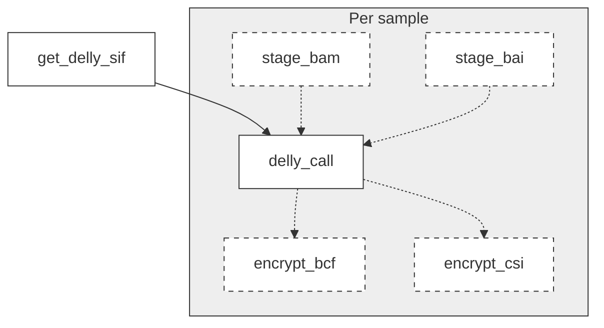

# ega2germlinedelly

Small [GWF](https://github.com/gwforg/gwf) workflow for running germline Delly 0.8.7. If EGAF IDs and a valid [EGA credential file](https://github.com/EGA-archive/ega-download-client/blob/master/pyega3/config/default_credential_file.json) is provided, will also use pyega3 to download the BAM and BAI files.



## Requirements
- python3 3.10.12
- [gwf](https://github.com/gwforg/gwf) 2.1.1
- [singularity](https://sylabs.io/singularity) 3.11.0
- [pyega3](https://github.com/EGA-archive/ega-download-client) 5.1.0 (optional)

## Installation
```
git clone git@github.com:tomdrever/ega2germlinedelly.git
python3 -m venv .venv
. .venv/bin/activate
pip install -r requirements.txt
```

## Usage
1. Copy and fill out the template config file and input csv. These specify staging and output directories, whether to encrypt the result files with a gpg key.
    ```
    cp config.json.template config.json
    cp input.csv.template input.csv
    ```

2. Check the targets generated.
    ```
    gwf status
    ```

3. Run the workflow.
    ```
    gwf run
    ```

4. (Optional) Remove the intermediates (Delly sif, staged EGA files if downloading and unencrypted Delly BCFs if encrypting).
    ```
    gwf clean
    ```
